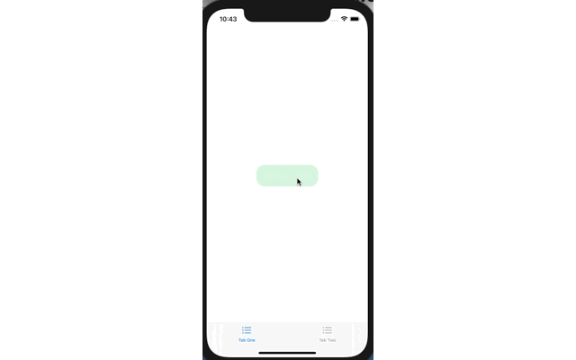

# TabViewTest
 TabView和NavigationLink 跳转多个页面过程中,去除下方的tabView

显示效果

连续跳转三个页面，其中第一个页面跳转到第二个不需要用NavigationLink

[问题解决之处](https://www.hackingwithswift.com/forums/swiftui/ios-14-recommendations-for-tabview-and-navigationview/3998)，但是没有Demo，特意写一下这个Demo

